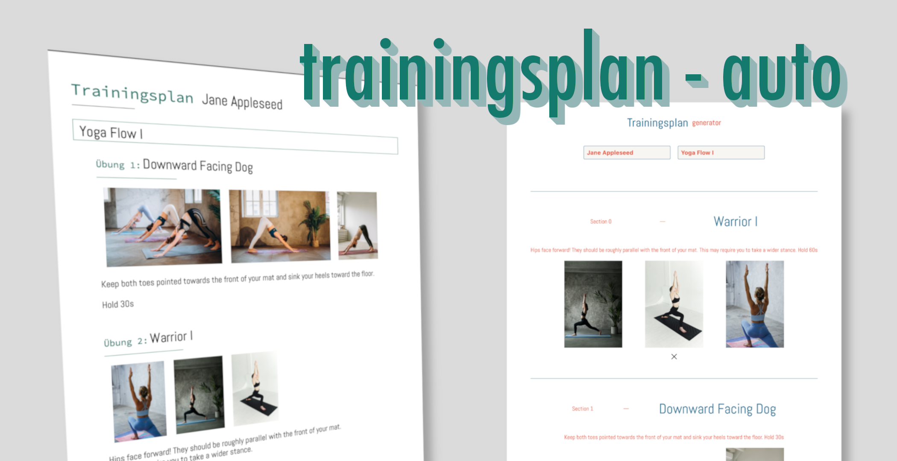

  

<b>
An easy to use webapp to create a training plan PDF with automatic styling of sections, images and branding.
</b>

 

- Thanks to a responsive design, the PDF can be created on any device
- By using a section based approach, the training plan can be created with a simple and intuitive interface
- All images are automatically optimized, scaled and styled

 

  <a href="https://itegs.github.io/trainingsplan-auto">View Demo</a>

